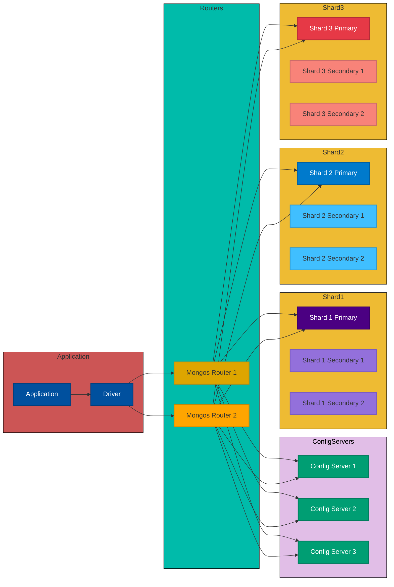

# 1. ARCHITEKTURA

## 1.1 Schéma a popis architektury
Tato kapitola podrobně popisuje, jak jsme nasadili NoSQL databázi (MongoDB) v rámci clusteru se třemi shardovanými replikovými sadami a dvěma routery.  
• V řešení využíváme tři konfigurační servery (Config Server Replica Set) pro správu metadat.  
• Dvě instance mongos (Router 1, Router 2) jako vstupní body pro klienty.  
• Tři shardy (Shard1, Shard2, Shard3), každý sestává z replikové sady se třemi uzly (Primární, Sekundární, Sekundární).  

Proč tato architektura:  
• Umožňuje horizontální škálování (sharding) a vysokou dostupnost (replikace).  
• Odchylka od doporučeného používání: Pro testovací účely provozujeme dva routery místo více, což je však stále prakticky použitelné pro demonstraci.

## 1.2 Specifika konfigurace

### 1.2.1 CAP teorém
• Splněny garance Partition tolerance (P) a nastavitelná míra Consistency (C).  
• Pro dané použití je dostatečné, protože preferujeme dostupnost a horizontální škálovatelnost.  

### 1.2.2 Cluster
• Používáme jeden logický cluster pro konsolidaci dat.  
• Vyhovuje požadavkům na výkon a snadnou údržbu.  

### 1.2.3 Uzly
• Minimálně 3 uzly v každé replikové sadě.  
• Zajišťují vyšší dostupnost a odolnost vůči výpadkům.  

### 1.2.4 Sharding
• Tři shardy z důvodu rovnoměrného rozložení dat.  
• Počet je dostačující pro současnou velikost dat.  

### 1.2.5 Replikace
• Každý shard replikován ve třech instancích.  
• Chrání data před lokálními selháními a podporuje škálování čtení.  

### 1.2.6 Perzistence dat
• Databáze ukládá data na disk s write-ahead logem.  
• Primární paměť využívána pro cache a indexy, sekundární pro dlouhodobé uložení.  
• Data načtena přímo do RAM, zápisy potvrzeny interními mechanismy.  

### 1.2.7 Distribuce dat
• Data rozdělena dle shard klíče, replikována v rámci shardů.  
• Routery obsluhují dotazy a distribuci pro čtení/zápis.  

### 1.2.8 Zabezpečení
• Autentizace a autorizace s admin účtem a rolemi.  
• Klíčový soubor pro šifrovanou repliku a šifrovanou komunikaci v clusteru.